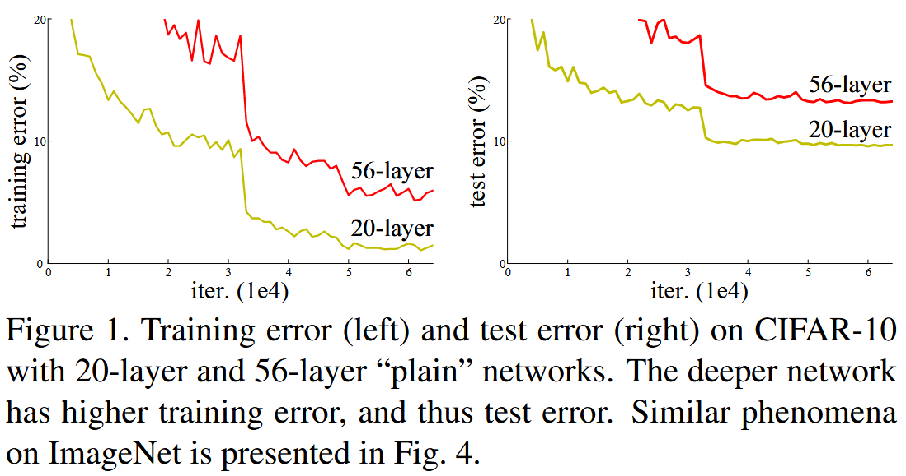
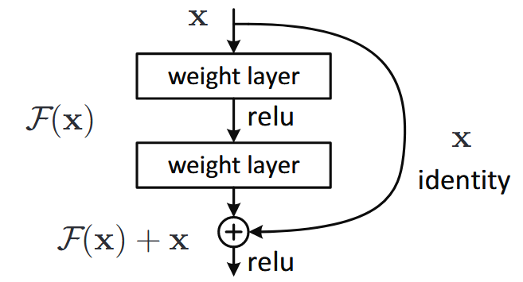
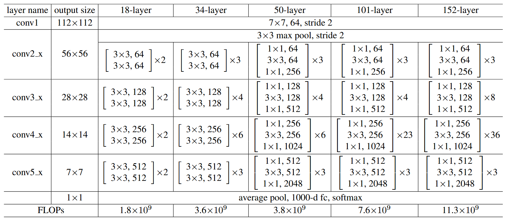

# ResNet

**Title**: [Deep Residual Learning for Image Recognition](http://arxiv.org/abs/1512.03385).

**Authors**: Kaiming He, Xiangyu Zhang, Shaoqing Ren, Jian Sun.

> **Deeper neural networks are more difficult to train**. We present a ***residual learning*** framework to ease the training of networks that are substantially deeper than those used previously. We explicitly reformulate the layers as learning residual functions with reference to the layer inputs, instead of learning unreferenced functions. We provide comprehensive empirical evidence showing that these residual networks are easier to optimize, and can gain accuracy from considerably increased depth. On the ImageNet dataset we evaluate residual nets with a depth of up to 152 layers—8× deeper than VGG nets [41] but still having lower complexity. An ensemble of these residual nets achieves 3.57% error on the ImageNet test set. This result won the 1st place on the ILSVRC 2015 classification task. We also present analysis on CIFAR-10 with 100 and 1000 layers.
>
> **The depth of representations is of central importance for many visual recognition tasks**. Solely due to our extremely deep representations, we obtain a 28% relative improvement on the COCO object detection dataset. Deep residual nets are foundations of our submissions to ILSVRC & COCO 2015 competitions1, where we also won the 1st places on the tasks of ImageNet detection, ImageNet localization, COCO detection, and COCO segmentation.


## Background

**网络深度**对于许多视觉识别任务来说是至关重要的，然而越深的模型就会越难以训练。通过仔细的**权重初始化和归一化层**（例如批量归一化、层归一化）使得几十层深的网络可以开始收敛了，缓解了梯度消失和梯度爆炸的问题。

当更深的网络开始收敛，一个性能下降的问题出现了：随着网络的深度加大，精确度开始饱和。不幸的是，这样的性能下降问题**不是由过拟合（Overfitting）造成的**，在一个适当深度的模型中添加额外的层会导致**更高的训练误差**。




在 ResNet 论文中，提出了一个**深度残差学习**（Deep Residual Learning）框架来解决这个性能下降问题。我们让一系列堆叠的层去拟合一个**残差映射 F(x)**，而不是拟合**底层映射 H(x)**，其中 **H(x) = F(x) + x**，实验表明，优化残差映射 F(x) 比原来的 H(x) 更简单。

实验表明，ResNet 可以从更深的网络得到**性能提升**，而其他简单堆叠层的网络则表现出更高的训练误差，同时 ResNet 赢得了 2015 年多项视觉任务的第一名。


## Deep Residual Learning


### Residual Learning

令 H(x) 表示一系列堆叠的层拟合的**底层映射**，其中 x 第一层的输入，我们拟合一个**残差映射** F(x) = H(x) - x，如果**等值映射**（Identity Mapping）是最优解，那么可以轻易地将这些层的权重优化为 0。下图为一个具有两个权重层的残差块：



若 F(x) 和 x 具有相同维度，那么可以直接按元素（element-wise）相加，否则需要经过一个**线性投影**去对齐维度。


### Network Architectures

ResNet 的不同深度的网络结构如下图所示，分别为 ResNet-18、ResNet-34、ResNet-50、ResNet-101、ResNet-152。

在 50 层以上的 ResNet 中，ResNet 使用了**瓶颈块**（bottleneck block）来**降低计算量**，具体来说每一个瓶颈块：

1. 使用一个 1x1 的卷积**降低**输入特征图的通道数。
2. 进行一个 3x3 卷积**保持**特征图通道数。
3. 通过一个 1x1 卷积**恢复**特征图的通道数。




## Implementations

一个针对于 CIFAR-10 的 ResNet 实现：

```python
class ResNet(nn.Module):
    """ResNet for CIFAR-10."""
    def __init__(self, num_channels: int=3, num_classes: int=10, layers: list[int]=[3, 3, 3]) -> None:
        """Initialize ResNet.

        Args:
            layers(list): specify number of residual blocks in each layer. Default is [3, 3, 3].
        """
        super(ResNet, self).__init__()
        self.in_channels = 16
        self.conv = conv3x3(num_channels, 16)
        self.bn = nn.BatchNorm2d(16)
        self.relu = nn.ReLU()
        self.layer1 = self.__make_layer(16, layers[0])
        self.layer2 = self.__make_layer(32, layers[1], 2)
        self.layer3 = self.__make_layer(64, layers[2], 2)
        self.avg_pool = nn.AvgPool2d(8)
        self.fc = nn.Linear(64, num_classes)
    
    def __make_layer(self, out_channels: int, blocks: int, stride=1) -> nn.Module:
        """Construct ResNet layer.

        Args:
            out_channels(int): number of output channels in this layer.
            blocks(int): number of residual block in this layer.
            stride(int): stride of convolution.

        Returns:
            Module: ResNet layer.
        """
        downsample = None
        if stride != 1 or self.in_channels != out_channels:
            downsample = nn.Sequential(
                conv3x3(self.in_channels, out_channels, stride=stride),
                nn.BatchNorm2d(out_channels))
        layers = [ResidualBlock(self.in_channels, out_channels, stride, downsample)]
        self.in_channels = out_channels
        for _ in range(1, blocks):
            layers.append(ResidualBlock(out_channels, out_channels))
        return nn.Sequential(*layers)
    
    def forward(self, images: Tensor) -> Tensor:
        """Forward pass

        Args:
            images(Tensor): input images of shape (N, C, 32, 32)
        
        Returns:
            Tensor: scores matrix of shape (N, D)
        """
        out: Tensor = self.conv(images)
        out = self.bn(out)
        out = self.relu(out)
        out = self.layer1(out)
        out = self.layer2(out)
        out = self.layer3(out)
        out = self.avg_pool(out)
        out = out.view(out.size(0), -1)
        out = self.fc(out)
        return out

class ResidualBlock(nn.Module):
    """Residual Block."""
    def __init__(self, in_channels: int, out_channels: int, stride: int=1, downsample=None) -> None:
        super(ResidualBlock, self).__init__()
        self.conv1 = conv3x3(in_channels, out_channels, stride)
        self.bn1 = nn.BatchNorm2d(out_channels)
        self.relu1 = nn.ReLU()
        self.conv2 = conv3x3(out_channels, out_channels)
        self.bn2 = nn.BatchNorm2d(out_channels)
        self.relu2 = nn.ReLU()
        self.downsample = downsample
    
    def forward(self, x: Tensor) -> Tensor:
        residual = x
        out = self.conv1(x)
        out = self.bn1(out)
        out = self.relu1(out)
        out = self.conv2(out)
        out = self.bn2(out)
        if self.downsample:
            residual = self.downsample(x)
        out += residual
        out = self.relu2(out)
        return out


# 3x3 convolution.
def conv3x3(in_channels: int, out_channels: int, stride: int=1) -> nn.Module:
    return nn.Conv2d(in_channels, out_channels, kernel_size=3,
                     stride=stride, padding=1)
```

