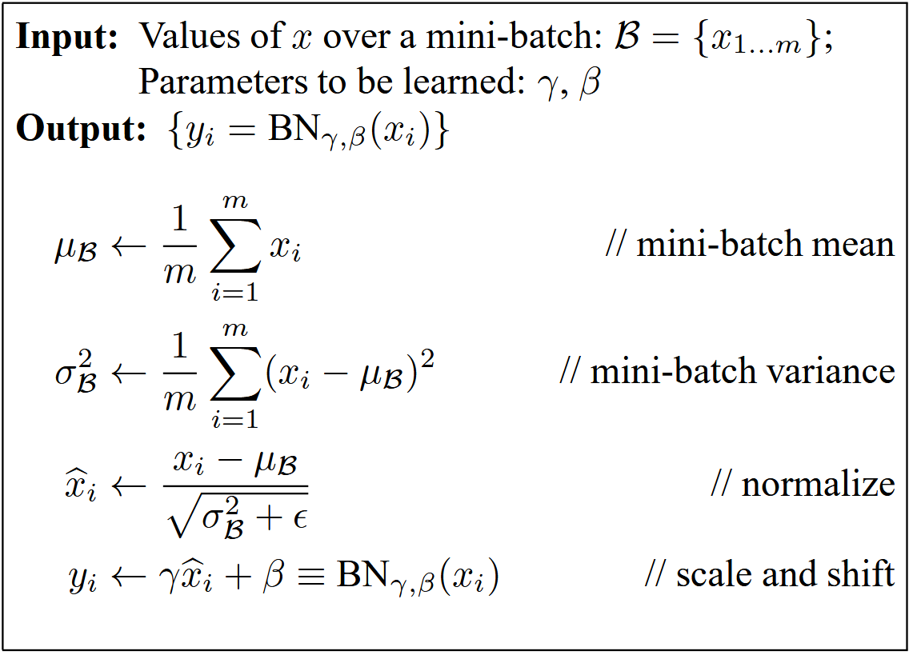
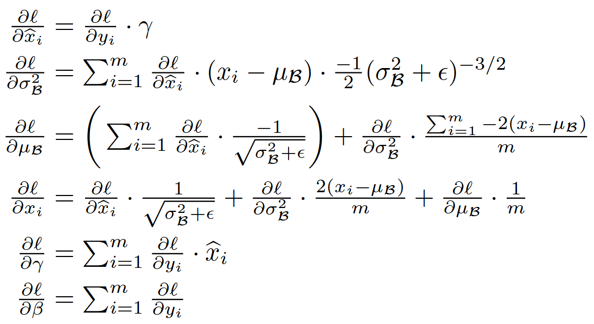

# Batch Normalization

**Title**: [Batch Normalization: Accelerating Deep Network Training by Reducing Internal Covariate Shift](http://arxiv.org/abs/1502.03167).

**Authors**: Sergey Ioffe, Christian Szegedy.

> **Training Deep Neural Networks is complicated** by the fact that **the distribution of each layer’s inputs changes during training, as the parameters of the previous layers change**. This slows down the training by requiring lower learning rates and careful parameter initialization, and makes it notoriously hard to train models with saturating nonlinearities. We refer to this phenomenon as ***internal covariate shift***, and address the problem by normalizing layer inputs. Our method draws its strength from making normalization a part of the model architecture and performing the normalization *for each training mini-batch*. **Batch Normalization allows us to use much higher learning rates and be less careful about initialization**. It also acts as a regularizer, in some cases eliminating the need for Dropout. Applied to a state-of-the-art image classification model, Batch Normalization achieves the same accuracy with 14 times fewer training steps, and beats the original model by a significant margin. Using an ensemble of batchnormalized networks, we improve upon the best published result on ImageNet classification: reaching 4.9% top-5 validation error (and 4.8% test error), exceeding the accuracy of human raters.


## Background

所谓的**内部协变量偏移**（Internal Covariate Shift），指的是深度神经网络在训练过程中，每一层的**输入分布**都会随着前一层的参数变化而**改变**。这种现象会导致使用了饱和的激活函数（例如 Sigmoid、Tanh 等）非常难以训练，例如，Sigmoid 函数的表达式如下

$$
\sigma(x)=\frac{1}{1+e^{-x}}
$$

当 $|x|$ 比较大时，$\sigma\prime (x)$（梯度）趋近于 0，这可能会造成**梯度消失**（vanishing gradients）的问题，实际上，饱和问题可以使用 **ReLU**、仔细的**权重初始化**和**较小的学习率**解决。


## Batch Normalization

对于一个层的输入 $x=(x^{(1)},x^{(2)},\dots,x^{(d)})$，在每一个维度上进行**归一化**，公式如下

$$
\hat{x}^{(k)}=\frac{x^{(k)}-E[x^{(k)}]}{\sqrt{Var[x^{(k)}]}}
$$


其中每个维度的期望和方差在整个训练数据集上计算。

注意到，**简单地归一化**每一层的输入可能会**改变这一层的表示**，为了恢复网络的表示能力，引入了一组**参数**，分别为**缩放参数** $\gamma$ 和**偏移参数** $\beta$

$$
y^{(k)}=\gamma^{(k)}\hat{x}^{(k)}+\beta^{(k)}
$$

参数 $\gamma$ 默认初始化为 1，参数 $\beta$ 默认初始化为 0。


### Mini-Batch Normalization

我们通常在实际的训练中使用**小批量随机梯度下降**（mini-batch stochastic gradient descent），同理，不需要在整个训练数据集中计算均值和方差，可以**使用一个小批量的数据来估计每个维度的均值和方差**，下图为**小批量归一化**算法（**前向传播**）：



其中 $\epsilon$ 为一个**很小的正数**，用来保证**数值稳定性**。




### Training Details

在训练时，我们使用**小批量数据**上计算的均值和方差统计信息，来进行批量归一化。实际上，我们使用**动量法**，计算方式如下：

```python
running_mean = momentum * running_mean + (1 - momentum) * mean
running_var = momentum * running_var + (1 - momentum) * variance
```

在测试模式下，不会计算 `running_mean` 和 `running_var`，仅使用训练时计算好的值。

## Implementations

下面是 BatchNorm 的 PyTorch 实现（`BatchNorm1d` 和 `Batchnorm2d`）：

```python
from torch import nn, Tensor

class BatchNorm1d(nn.Module):
    """Batchnorm layer."""
    def __init__(self, dim: int) -> None:
        """Initialize a Batchnorm layer.
        
        Args:
            dim(int): input dimension.
        """
        super(BatchNorm1d, self).__init__()
        # Initialize scale and shift parameters.
        self.gamma = torch.ones(dim, 1)
        self.beta = torch.zeros(dim, 1)
        self.epsilon = 1e-6
    
    def forward(self, x: Tensor) -> Tensor:
        """Forward pass in Batchnorm.
        
        Args:
            x(Tensor): input tensor of shape (N, D)
        """
        # Compute mean and variance over a mini-batch.
        mean = torch.mean(x, dim=0, keepdim=True)
        variance = torch.var(x, dim=0, keepdim=True)
        # Normalize.
        x_norm = (x - mean) / torch.sqrt(self.epsilon + variance)
        # Scale and shift.
        out = self.gamma * x_norm + self.beta
        return out


class BatchNorm2d(nn.Module):
    """Batchnorm layer."""
    def __init__(self, num_channels: int) -> None:
        """Initialize a Batchnorm layer.
        
        Args:
            num_channels(int): number of channels of input feature map.
        """
        super(BatchNorm2d, self).__init__()
        # Initialize scale and shift parameters.
        self.gamma = torch.ones(num_channels)
        self.beta = torch.zeros(num_channels)
        self.epsilon = 1e-6
    
    def forward(self, x: Tensor) -> Tensor:
        """Forward pass in Batchnorm.
        
        Args:
            x(Tensor): input feature map of shape (N, C, H, W).
        """
        N, C, H, W = x.shape
        # Compute mean and variance over a mini-batch.
        x = torch.permute(x, dims=(0, 2, 3, 1))
        x = x.view(N * H * W, C)
        mean = torch.mean(x, dim=0, keepdim=True)
        variance = torch.var(x, dim=0, keepdim=True)
        # Normalize.
        x_norm = (x - mean) / torch.sqrt(self.epsilon + variance)
        # Scale and shift.
        out = self.gamma * x_norm + self.beta
        out = out.view(N, H, W, C)
        out = torch.permute(0, 3, 1, 2)
        return out

```

