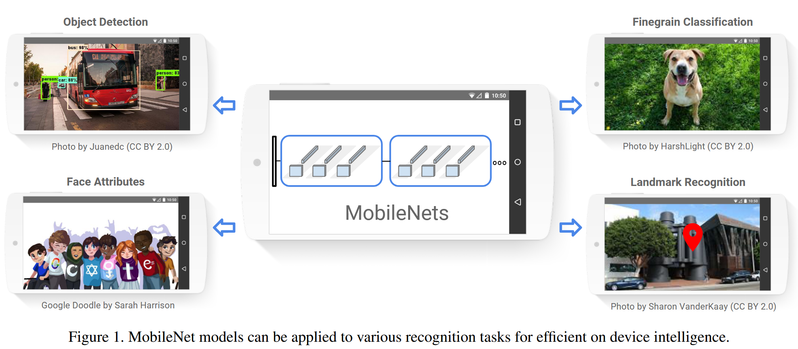

# MobileNetV1

MobileNets 是一种轻量级模型，使用了大量的深度可分离卷积，面向于移动或嵌入式设备等计算资源有限的平台，Mobilenets 提供了两个超参数宽度乘数 $\alpha$ 和分辨率乘数 $\beta$ 来构建更轻量化的模型。



## Abstract

We present a class of efficient models called MobileNets for mobile and embedded vision applications. MobileNets are based on a streamlined architecture that uses depthwise separable convolutions to build lightweight deep neural networks. We introduce two simple global hyperparameters that efficiently trade-off between latency and accuracy. These hyper-parameters allow the model builder to choose the right-sized model for their application based on the constraints of the problem. We present extensive experiments on resource and accuracy tradeoffs and show strong performance compared to other popular models on ImageNet classification. We then demonstrate the effectiveness of MobileNets across a wide range of applications and use cases including object detection, fine grain classification, face attributes, and large-scale geo-localization.


## Method


### Depthwise Separable Convolution

MobileNets 的核心是**深度可分离卷积**（Depthwise Separable Convolution），下图展示了深度可分离卷积的过程：

1. 将输入特征图按通道分离得到 N 个深度为 1 的特征图。
2. 在 N 个特征图上进行标准卷积，得到 N 个深度为 1 的输出特征图。
3. 将 N 个输出特征图合并，进行 1x1 的标准卷积。

最后进行 1x1 卷积的作用在于**特征融合**和**改变输出特征图的通道数**。


假设有一个形状为 $(N, H, W)$ 的输入特征图，$M$ 个形状为 $(F, F)$ 卷积核，分别进行步长为 $S$ 的**标准卷积**和**深度可分离卷积**。显然两种卷积方式的输出特征图维度相同，不妨设为 $(M, H_o, W_o)$，下面比较两种卷积方式的计算量。

**标准卷积的计算量为**

$$
H_o\times W_o\times F^2\times N\times M
$$

**深度可分离卷积的计算量为**

$$
H_{o}\times W_{o} \times F^2 \times N +H_{o}\times W_{o}\times N\times M=H_{o}\times W_{o}\times N \times(F^2+M)
$$

因此深度可分离卷积的计算量是标准卷积计算量的

$$
\frac{1}{M}+\frac{1}{F^2}
$$
因此相对于标准卷积，深度可分离卷积的计算量大大减少，MobileNets 基于深度可分离卷积构建出一种高效的卷积神经网络。

下面是实现深度可分离卷积的 PyTorch 代码：

```python
from torch import nn, Tensor

class DepthwiseSaparableConv2d(nn.Module):
    """Depthwise separable convolution layer."""

    def __init__(
        self,
        in_channels: int,
        out_channels: int,
        kernel_size: int,
        stride: int = 1,
        padding: int = 0,
        dilation: int = 1,
    ) -> None:
        super(DepthwiseSaparableConv2d, self).__init__()
        # depthwise convolution
        self.dw_conv = nn.Conv2d(
            in_channels,
            in_channels,
            kernel_size=kernel_size,
            stride=stride,
            padding=padding,
            dilation=dilation,
            groups=in_channels,
        )
        self.bn1 = nn.BatchNorm2d(in_channels)
        self.relu1 = nn.ReLU(inplace=True)

        # pointwise convolution
        self.pw_conv = nn.Conv2d(in_channels, out_channels, kernel_size=1)
        self.bn2 = nn.BatchNorm2d(out_channels)
        self.relu2 = nn.ReLU(inplace=True)

    def forward(self, x: Tensor):
        out = self.dw_conv(x)
        out = self.bn1(out)
        out = self.relu1(out)

        out = self.pw_conv(out)
        out = self.bn2(out)
        out = self.relu2(out)
        return out
```


### Model Architecture

MobileNetV1 的模型结构如下图所示，总的参数量为 3.18 M，总的计算量为 1.61 GFLOPS。


#### Width Multiplier & Resolution Multiplier

MobileNets 提出了两个超参数，分别为**宽度乘数** $\alpha$ 和**分辨率乘数** $\beta$，分别通过**减少每一层的卷积核数量**和**降低输入图片的分辨率**来降低计算量。

- 通过将卷积核的数量减小为原来的 $\alpha$ 倍来降低网络的计算量，$\alpha$ 的典型取值为 1、0.75、0.50、0.25。
- 通过将输入图片的分辨率减小为原来的 $\beta$ 倍来降低网络的计算量。

通过应用宽度乘数和分辨率乘数，单个深度可分离卷积的计算量变为：
$$
\beta\times H_{o}\times \beta\times W_{o} \times F^2 \times\alpha\times N +\beta\times H_{o}\times \beta\times W_{o}\times\alpha\times N\times \alpha\times M
$$
假设原始的输入图片大小为 224x224，下表展示了不同宽度乘数 $\alpha$ 和分辨率乘数 $\beta$ 取值，MoblieNet 的参数量和计算量：

| Model              | Params | GFLOPS |
| ------------------ | ------ | ------ |
| 1.0 MobileNet-224  | 4.24M  | 1.76   |
| 0.75 MobileNet-224 | 2.59M  | 1.02   |
| 0.50 MobileNet-224 | 1.34M  | 0.48   |
| 0.25 MobileNet-224 | 0.47M  | 0.14   |
| 1.0 MobileNet-192  | 4.24M  | 1.30   |
| 1.0 MobileNet-160  | 4.24M  | 0.90   |
| 1.0 MobileNet-128  | 4.24M  | 0.58   |


## Reference

[1] Howard, Andrew G., Menglong Zhu, Bo Chen, Dmitry Kalenichenko, Weijun Wang, Tobias Weyand, Marco Andreetto, and Hartwig Adam. “MobileNets: Efficient Convolutional Neural Networks for Mobile Vision Applications.” arXiv, April 17, 2017. https://doi.org/10.48550/arXiv.1704.04861.

