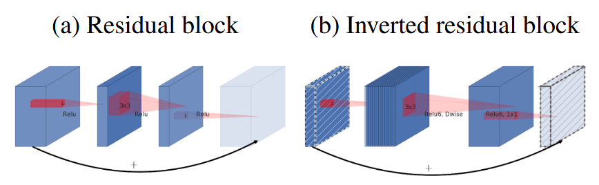
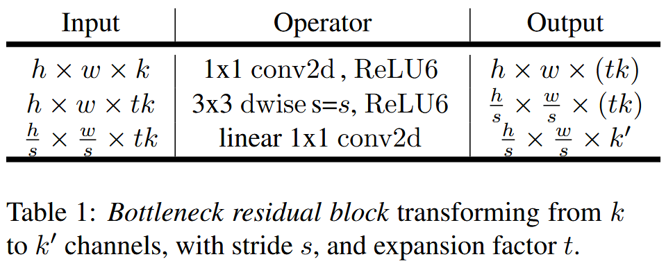
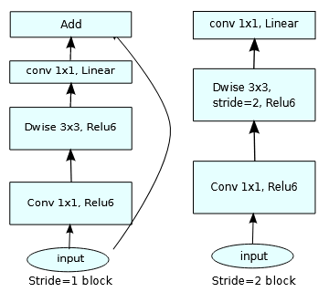
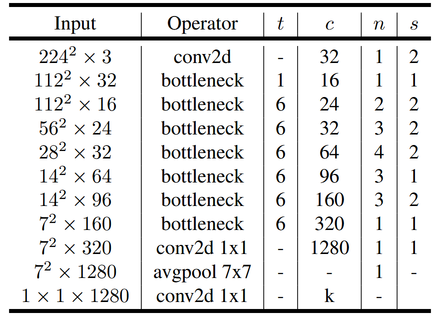
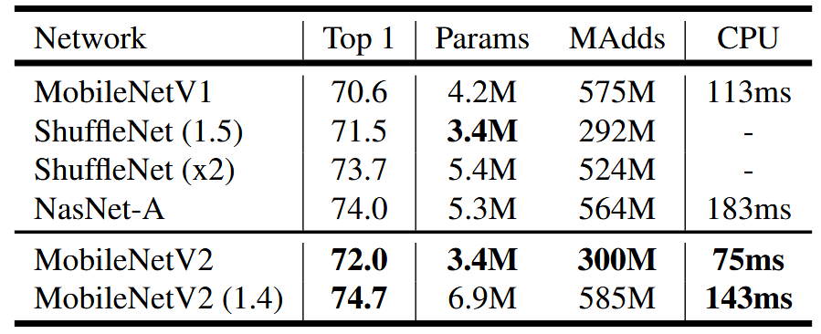

# MobileNetV2

MobileNetV2 是一种新的轻量级模型，面向于计算资源有限的平台例如移动设备、嵌入式设备，与 MobileNetV1 一样，MobileNetV2 使用了深度可分离卷积来降低计算量，同时使用一种新的模块称为 Inverted Residual Block，与标准 ResNet 的 Bottleneck 不同，在 MobileNet 的 Inverted Residual Block 的残差连接应用于深度较小的特征图之间，MobileNetV2 的参数量和计算量比 MobileNetV1 更小，但是在 ImageNet 分类任务中却取得更好的性能，MobileNetV2 同时也具有宽度乘数 $\alpha$ 和分辨率乘数 $\beta$ 两个超参数来降低模型训练和推理的计算量，以构建更加轻量化的模型。


## Abstract

In this paper we describe a new mobile architecture, MobileNetV2, that improves the state of the art performance of mobile models on multiple tasks and benchmarks as well as across a spectrum of different model sizes. We also describe efficient ways of applying these mobile models to object detection in a novel framework we call SSDLite. Additionally, we demonstrate how to build mobile semantic segmentation models through a reduced form of DeepLabv3 which we call Mobile DeepLabv3.

is based on an inverted residual structure where the shortcut connections are between the thin bottleneck layers. The intermediate expansion layer uses lightweight depthwise convolutions to filter features as a source of non-linearity. Additionally, we find that it is important to remove non-linearities in the narrow layers in order to maintain representational power. We demonstrate that this improves performance and provide an intuition that led to this design.

Finally, our approach allows decoupling of the input/output domains from the expressiveness of the transformation, which provides a convenient framework for further analysis. We measure our performance on ImageNet [1] classification, COCO object detection [2], VOC image segmentation [3]. We evaluate the trade-offs between accuracy, and number of operations measured by multiply-adds (MAdd), as well as actual latency, and the number of parameters.


## Method

MobileNetV2 与 MobileNetV1 都是基于[**深度可分离卷积**](./mobilenetv1.md)（Depthwise Separable Convolution）构建的一种轻量级模型，深度可分离卷积的计算量是标准卷积的 $\frac{1}{M}+\frac{1}{F^2}$ 倍，其中 $M$ 为输出特征图的通道数，$F$ 为卷积核的大小，通过大量使用深度可分离卷积，大大降低了模型的参数量和计算量。


### Inverted Residual with linear bottleneck

与 MobileNetV1 不同，MobileNetV2 使用了**残差连接**（Residual Connection），采用了 Inverted Residual block，与 ResNet 的 Bottleneck 的区别在于：

- ResNet 在**深度较大**的特征图之间进行残差连接，而 MobileNet 则是在**深度较小**的特征图之间进行残差连接。
- MobileNetV2 采用了 linear bottleneck 的设计，在bottleneck 最后的 1x1 卷积恢复原始特征图通道后，不使用非线性激活函数，防止低维度计算使用非线性激活函数丢失一些信息。
- MobileNetV2 的 bottleneck 块中间使用了 3x3 的**深度卷积**（depthwise convolution）来降低计算量。
- MobileNetV2 采用了 ReLU6 激活函数。



下表展示了 MobileNetV2 的 bottleneck 结构：



在 MobileNetV2 的设计中，在步长为 2 的 linear bottleneck 中，不使用残差连接。



下面是实现 Linear Bottleneck 的 PyTorch 代码：

```python
from torch import nn, Tensor

class Bottleneck(nn.Module):
    """Bottleneck in MobileNetV2.

    Architecture: [1x1 conv - bn - relu6] - [3x3 depthwise conv - bn - relu6] - [1x1 conv - bn]
    """

    def __init__(
        self, in_channels: int, out_channels: int, stride: int = 1, expansion: int = 6
    ) -> None:
        """Initialize a Bottleneck.

        Args:
            in_channels (int): number of channels of input feature map.
            out_channels (int): number of channels of output feature map.
            stride (int, optional): stride of depthwise convolution. Defaults to 1.
            expansion (int, optional): expansion ratio for the first 1x1 convolution. Defaults to 6.
        """
        super(Bottleneck, self).__init__()
        self.shortcut = stride == 1
        mid_channels = in_channels * expansion
        self.conv1 = nn.Conv2d(in_channels, mid_channels, kernel_size=1)
        self.bn1 = nn.BatchNorm2d(mid_channels)
        self.relu1 = nn.ReLU6(inplace=True)
        # depthwise convolution
        self.conv2 = nn.Conv2d(
            mid_channels,
            mid_channels,
            kernel_size=3,
            stride=stride,
            padding=1,
            groups=mid_channels,
        )
        self.bn2 = nn.BatchNorm2d(mid_channels)
        self.relu2 = nn.ReLU6(inplace=True)
        self.conv3 = nn.Conv2d(mid_channels, out_channels, kernel_size=1)
        self.bn3 = nn.BatchNorm2d(out_channels)

    def forward(self, x: Tensor):
        out = self.conv1(x)
        out = self.bn1(out)
        out = self.relu1(out)
        out = self.conv2(out)
        out = self.bn2(out)
        out = self.relu2(out)
        out = self.conv3(out)
        out = self.bn3(out)
        if self.shortcut:
            out += x
        return out
```


### Model Architecture

下表展示了 MobileNetV2 的详细结构，t 表示通道扩张的倍数（expansion ratio），c 表示这一层中所有特征图的通道数，n 表示某一层使用的 bottleneck 数量，s 表示某一层第一个 bottleneck 中深度卷积的步长，k 表示图像的类别数。



标准的 MobileNetV2 参数量为 3.4M，而 MobileNetV1 参数量为 4.2M，降低了参数量和计算量，因此模型训练和推理速度提高，同时在 ImageNet 数据集上取得了比 MobileNetV1 更好的结果，结果如下图所示：



作者还进行了消融实验，证明了 Inverted Residual Block 的性能好于在 ResNet 中使用的标准 Bottleneck，同时也证明了 Linear Bottleneck 性能更好。


## Reference

[1] Howard, Andrew G., Menglong Zhu, Bo Chen, Dmitry Kalenichenko, Weijun Wang, Tobias Weyand, Marco Andreetto, and Hartwig Adam. “MobileNets: Efficient Convolutional Neural Networks for Mobile Vision Applications.” arXiv, April 17, 2017. https://doi.org/10.48550/arXiv.1704.04861.

[2] Sandler, Mark, Andrew Howard, Menglong Zhu, Andrey Zhmoginov, and Liang-Chieh Chen. “MobileNetV2: Inverted Residuals and Linear Bottlenecks.” arXiv, March 21, 2019. https://doi.org/10.48550/arXiv.1801.04381.

[3] He, Kaiming, Xiangyu Zhang, Shaoqing Ren, and Jian Sun. “Deep Residual Learning for Image Recognition.” arXiv, December 10, 2015. https://doi.org/10.48550/arXiv.1512.03385.