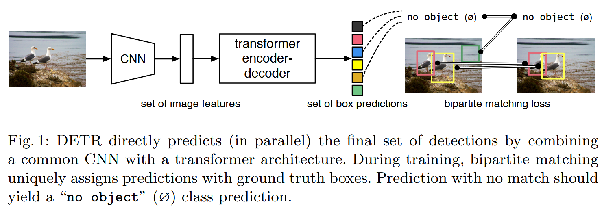
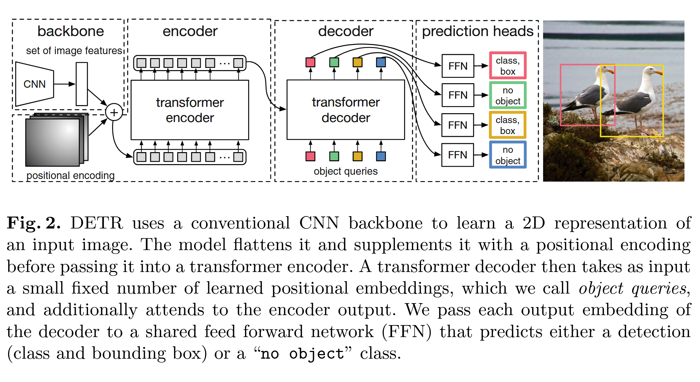

# DETR

## Abstract

We present a new method that views object detection as a direct set prediction problem. Our approach streamlines the detection pipeline, effectively removing the need for many hand-designed components like a non-maximum suppression procedure or anchor generation that explicitly encode our prior knowledge about the task. The main ingredients of the new framework, called DEtection TRansformer or DETR, are a set-based global loss that forces unique predictions via bipartite matching, and a transformer encoder-decoder architecture. Given a fixed small set of learned object queries, DETR reasons about the relations of the objects and the global image context to directly output the final set of predictions in parallel. The new model is conceptually simple and does not require a specialized library, unlike many other modern detectors. DETR demonstrates accuracy and run-time performance on par with the well-established and highly-optimized Faster RCNN baseline on the challenging COCO object detection dataset. Moreover, DETR can be easily generalized to produce panoptic segmentation in a unified manner. We show that it significantly outperforms competitive baselines. Training code and pre-trained models are available at https://github.com/facebookresearch/detr.

## Method

### Overview

**目标检测**（Object Detection）的目的是对于每个感兴趣的目标或物体预测一组**边界框**（Bounding Box）和对应的**类别**（Category）。

下图在一个比较 high-level 的视角展现了 **DETR**(**DE**tection **TR**ansformer)：

- 首先输入图片通过卷积神经网络（CNN）提取特征，然后转换为 Transformer 的 Input Embedding 序列，输入到 Transformer 中。
-  Transformer Encoder 负责将输入序列进行编码，获取对应的 latent representation。
-  Transformer Decoder 的输入为 $M$ 个可学习的 ***Object Queries*** Token 序列，结合编码器的输出进行解码。
- 通过一个 MLP Head 将解码器的输出转换为 box predictions。

> [!NOTE]
>
> - DETR 一次性预测所有的目标。
> - 如果一个 box 没有匹配到一个目标，那么它的类别应该为 $\phi$，表示 **no object**。
>
> - 解码的过程是**并行**（Parallel）的，这与原始 Transformer 的每个时间步产生一个输出的自回归方式不同。

与大多数之前的直接集合预测工作相比，DETR 的主要特征是将**二分匹配损失**（Bipartie Matching Loss）与并行解码的 Transformer 相结合。

### Object Detection Set Prediction Loss

DETR 在通过解码器的单次传递中推理出一组固定大小的 $N$ 个预测结果，其中 $N$ 设置为明显大于图像中目标的数量，模型训练的一个主要难点是如何对预测结果（类别，位置，大小）和对应的 Ground Truth 进行评分，DETR 采用在预测对象和地面真实对象之间产生**最佳二分匹配**，然后优化特定于对象（边界框）的损失。

假设 $y$ 为一组 Ground Truth 目标集合，$\hat{y}=\set{\hat{y_i}}_{i=1}^N$ 为模型的 $N$ 个预测结果，若 $y$ 的目标数量不足 $N$，则使用 $\phi$(**no object**) 进行填充，一个**最优二分匹配损失**就是要找到一个损失最小的排列 $\sigma \in \mathfrak{S}_N$：

$$
\hat{\sigma}=\arg \min_{\sigma \in\mathfrak{S}_N} \sum_{i=1}^N \mathcal{L}_{\text{match}} (y_i,\hat{y}_{\sigma(i)})
$$

其中 $\mathcal{L}_{\text{match}} (y_i,\hat{y}_{\sigma(i)})$ 是成对的匹配损失（matching loss），根据 Hungarian 算法可以高效地计算出这样的匹配。

$$
\mathcal{L}_{\text{match}} (y_i,\hat{y}_{\sigma(i)})=-\mathbb{1}_{c_i\ne \phi}\hat{p}_{\sigma(i)}(c_i)+\mathbb{1}_{c_i\ne \phi}\mathcal{L}_{\text{box}}(b_i,\hat{b}_{\sigma(i)})
$$

**通过最佳二分匹配，可以避免冗余的预测**。因此最终的损失函数为：

$$
\mathcal{L}_{\text{Hungarian}}(y,\hat{y})=\sum_{i=1}^N[-\log\hat{p}_{\sigma(i)}(c_i) + \mathbb{1}_{c_i\ne \phi}\mathcal{L}_{\text{box}}(b_i,\hat{b}_{\sigma(i)})]
$$

在实践中，当 $c_i=\phi$ 时通常将负对数概率项的 loss weight 设置为 0.1 来缓解**类别不均衡**的问题。

在 matching loss 中不使用负对数概率，而是负概率，这种设定使得类别损失项和边界框损失项的尺度接近，可以获得更好的性能。

$$
\mathcal{L}_{\text{box}}(b_i,\hat{b}_{\sigma(i)})=\lambda_{\text{iou}}\mathcal{L}_{\text{iou}}(b_i,\hat{b}_{\sigma(i)})+\lambda_{\text{L1}}\mathcal{L}_{\text{L1}}\left\| b_i -\hat{b}_{\sigma(i)} \right\|_1
$$

这两个损失通过 batch 内的目标数量进行归一化。

## Mobel Architecture

DETR 模型的详细结构如下图所示，包含三个组件：

1. CNN backbone：提取图像的特征表示。
2. Encoder-Decoder Transformer：将输入序列进行编码和解码。
3. FFN(Feed Forward Network)：获得最终的预测结果。

通过一个 CNN （例如 ResNet-50）获得 $3\times H_0\times W_0$ 的图片的低分辨率的特征图，大小为 $C\times H\times W$，典型的值为：$C=2048$ 以及 $H,W=\frac{H_0}{32},\frac{W_0}{32}$。

在生成 Transformer 的输入序列之前，CNN 产生的特征图会通过一次 1x1 conv 进行特征降维，得到一个新的特征图 $z_0$，大小为 $d\times H\times W$，然后将特征图 $z_0$ 进行 flatten 操作获得长度为 $HW$ 的序列（Input Embedding），加上一个位置编码后作为 Transformer 的输入序列。与标准 Transformer 不同，DETR 采用并行解码的方式，而不是使用自回归的方式，每个时间步产生一个输出结果。

FFN 由 3 层具有 ReLU 激活函数的 MLP 组成，其隐藏层维度为 $d$，用来产生预测结果，包括目标类别和边界框中心点、宽度和高度的预测结果。

Decoder 的每一层均使用一个共享的**辅助头**（Auxiliary Head），用来帮助模型的训练。

## Reference

[1] Carion, Nicolas, Francisco Massa, Gabriel Synnaeve, Nicolas Usunier, Alexander Kirillov, and Sergey Zagoruyko. “End-to-End Object Detection with Transformers.” In *Computer Vision – ECCV 2020*, edited by Andrea Vedaldi, Horst Bischof, Thomas Brox, and Jan-Michael Frahm, 12346:213–29. Cham: Springer International Publishing, 2020. https://link.springer.com/10.1007/978-3-030-58452-8_13.